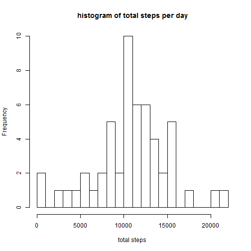
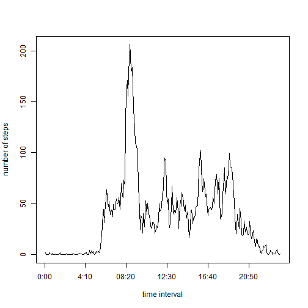
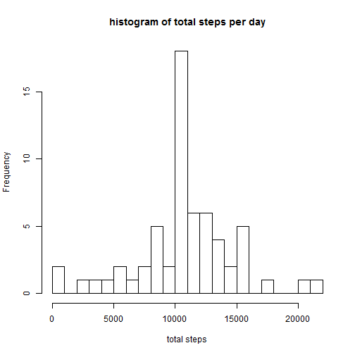
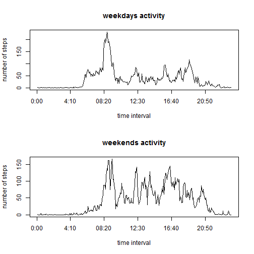

# Reproducible Research: Peer Assessment 1


## Loading and preprocessing the data

```r
# raw data is read directly from the compressed activity.zip file 
data <- read.table(unz("activity.zip", "activity.csv"), header=TRUE, sep=",")
# make sure date column is in the proper format
data$date = as.Date(data$date, format="%Y-%m-%d")
```

## What is mean total number of steps taken per day?

a histogram of the total number of steps taken per day, followed by the corresponding mean and median 
(NA values are ignored) 

```r
# compute total number of steps for each day
sumdataNONA <- tapply(data$steps, data$date, sum, na.rm=TRUE)
# display histogram
hist(sumdataNONA, breaks=20, main="histogram of total steps per day", xlab="total steps")
```

 

```r
#report mean
mean(sumdataNONA)
```

```
## [1] 9354
```

```r
#report median
median(sumdataNONA)
```

```
## [1] 10395
```

## What is the average daily activity pattern?

the activity pattern

```r
# compute total number of steps for each time interval 
timedata <- tapply(data$steps, data$interval, mean, na.rm=TRUE)
plot(timedata, type="l", xlab="time interval", ylab="number of steps", xaxt='n'); axis(1, labels = c('0:00', '4:10', '08:20', '12:30', '16:40', '20:50'), at = c(0, 50, 100, 150, 200, 250))
```

 

The interval with the maximum number of steps

```r
maxstepcount <- timedata[timedata == max(timedata)]
maxstepinterval <- names(timedata[timedata == max(timedata)])
maxstepinterval
```

```
## [1] "835"
```
on average across all the days in the dataset, it is the 835 interval that contains the maximum number of steps  (with 206.1698 steps)


## Imputing missing values


```r
missingvaluescount <- sum(is.na(data$steps))
```
there are 2304 rows with missing values in the dataset
for each row where a value is missing, the number of steps used will  be the mean for the corresponding interval

Create a new dataset that is equal to the original dataset but with the missing data filled in.

```r
reptimedata <- rep(timedata, 61)
extdata <- data
extdata$steps <- ifelse(is.na(extdata$steps), reptimedata, extdata$steps)
```


with data corrected as mentioned above (NA values replaced by the mean for the corresponding interval),  
the histogram of total steps per day, the mean and the median are as follows.

```r
# compute total number of steps for each day
extsumdata <- tapply(extdata$steps, extdata$date, sum, na.rm=TRUE)
# display histogram
hist(extsumdata, breaks=20, main="histogram of total steps per day", xlab="total steps")
```

 

```r
#report mean
mean(extsumdata)
```

```
## [1] 10766
```

```r
#report median
median(extsumdata)
```

```
## [1] 10766
```
replacing missing data with estimated values caused the mean and median to increase.


## Are there differences in activity patterns between weekdays and weekends?


include weekdy/weekend info in the dataset

```r
weekdata <- extdata
weekdata$daytype <- as.factor(ifelse(weekdays(weekdata$date) %in% c("Sunday", "Saturday"), "weekend", "weekday"))
```

compared activity profile between weekdays and weekends

```r
timedataweekdays <- tapply(weekdata$steps[weekdata$daytype=="weekday"], weekdata$interval[weekdata$daytype=="weekday"], mean)
timedataweekends <- tapply(weekdata$steps[weekdata$daytype=="weekend"], weekdata$interval[weekdata$daytype=="weekend"], mean)
par(mfrow = c(2,1))
plot(timedataweekdays, type="l", main="weekdays activity", xlab="time interval", ylab="number of steps", xaxt='n'); axis(1, labels = c('0:00', '4:10', '08:20', '12:30', '16:40', '20:50'), at = c(0, 50, 100, 150, 200, 250))
plot(timedataweekends, type="l", main="weekends activity", xlab="time interval", ylab="number of steps", xaxt='n'); axis(1, labels = c('0:00', '4:10', '08:20', '12:30', '16:40', '20:50'), at = c(0, 50, 100, 150, 200, 250))
```

 

